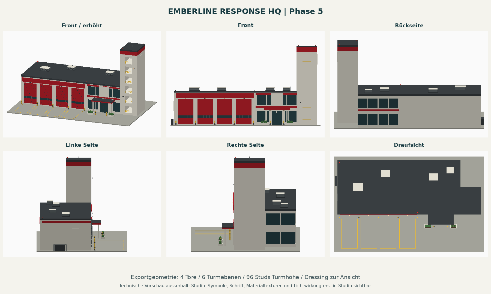

# Emberline Response HQ - LC-45

Einzelne Fire Station für Large City. **Phase 5: Materialien und Details ergänzt. P4 vom Nutzer freigegeben; P5-Sichtprüfung offen.**
Dieser Branch ersetzt das alte Drei-Tore-/34-Stud-Konzept durch [Issue #3](https://github.com/amanciobouza/trenchborn-asset-workshop/issues/3).
Kein Kit, keine Varianten, keine zweite Feuerwache auf LC-17.

## Modell öffnen

1. `dist/LargeCityEmberlineResponseHQ_P5.rbxmx` herunterladen.
2. In einem leeren Roblox-Studio-Projekt als Modell in `Workspace` einfügen.
3. Das Modell `LargeCity_EmberlineResponseHQ_P5` auswählen und fokussieren.
4. Front ist lokal **-Z**. Der unsichtbare `GroundPivot` liegt im Grundstückszentrum auf Bodenhöhe.

Das Paket enthält echte, verankerte Parts, Baugruppen und das Fassadenschild. Es benötigt keine Scripts, externen Meshes, Bilder oder andere Gebäude. Der P4-Import wurde vom Nutzer in Studio bestätigt. Der neue P5-Export ist strukturell geprüft, aber noch nicht in Studio getestet.

## Reproduzierbar bauen

```sh
python3 tools/build_emberline.py
# Optional: sechs technische Ansichten, benötigt numpy und Pillow
python3 tools/build_emberline.py --preview
```

Der Generator schreibt das statische `.rbxmx`, einen gleich aufgebauten Luau-Builder und den Prüfbericht. Phase-5-Details stehen in `tools/emberline_dressing.py`. Änderungen erfolgen an diesen Quellen; danach Ausgaben neu erzeugen und gemeinsam committen.

Alternativ verbindet `default.project.json` den isolierten Emberline-Workshop mit Rojo. Beim Starten des Play-Modus erzeugt `EmberlinePreview` das Modell und wendet das Dressing an. Nach einem Update bitte Stop, Rojo-Synchronisierung, erneut Play. Es werden keine anderen Gebäude oder Guardian-Module geladen. `package.project.json` ist nur das optionale Quellmodul-Paket; das direkt sichtbare Gebäudemodell liegt in `dist/`.

```lua
local builder = require(game.ReplicatedStorage.TrenchbornAssetWorkshop.LargeCityEmberlineGoldenMaster)
local building = builder.Build(workspace, {GroundCFrame = CFrame.new(0, 0, 0)})
require(game.ReplicatedStorage.TrenchbornAssetWorkshop.LargeCityEmberlineDressing).Apply(building)
```

## Review



Die Ansichten werden aus denselben Parts wie der Export berechnet, ausserhalb Roblox Studio. Sie enthalten keine Engine-Beleuchtung, keine Schattenberechnung und keine SurfaceGui-Schrift oder Symbole. Das Namensschild wird im Roblox-Modell dargestellt.

Siehe [Review und Bauentscheidungen](docs/emberline/REVIEW.md) und [P5-Dressing](docs/emberline/DRESSING.md) und [automatische Prüfungen](docs/emberline/dressing-checks.json).

**Gate B vom Nutzer freigegeben.** P5-Sichtprüfung, P6-Spielintegration und Gate C sind offen. `KaijuHouse`, `MaxHealth` und `EnergyType` sind absichtlich noch nicht gesetzt: die Werte sind nicht freigegeben. Es gibt keine Fahrzeuge, NPCs oder Feuerwehrlogik im Export.

Die spätere Stadtposition ist LC-45. Der Plan v2.1 hat **City im Norden und Mega City im Süden**. Eine Stadtplatzierung ist noch nicht ausgeführt.
