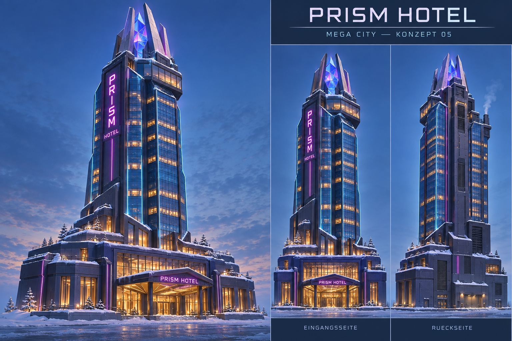

# MC-05 — Prism Hotel

**Stadtteil:** Neon Quarter  
**EnergyType:** `Electric`  
**Status:** Modell zur Studio-Abnahme erstellt; Gate B und Gate C offen.

## Freigegebenes Konzept

Schlanker facettierter Hotelturm, vorspringende Sky-Lounge, leuchtende Prismakrone, vertikales PRISM-Schild. Breiter Eingangssockel und warme Lobby.

## Besondere Anforderungen

Turm, Krone und Sockel gemeinsam.

## Zielbild

## Gemeinsame Vorgaben

- Frozen Cyberpunk Megacity: dunkles Petrol/Violett, blaues Glas, Cyan/Magenta, warme Fenster, Schnee und sichtbare Technik. Radiation wird grün gekennzeichnet.
- Klare Silhouette auch ohne Reklame; grosse Roblox-taugliche Formen. Zielbilder sind künstlerische Referenzen, keine masshaltigen Baupläne. Ansichtsabweichungen vor P4 auflösen.
- Jedes Grundmodell kollabiert als EINE Zerstörungseinheit. Separate Stadtumgebung bleibt separat.
- Nur Roblox Studio; kein Blender. Spätere Integration: Tag `KaijuHouse`, `MaxHealth` (Number), `EnergyType` (String).
- Dimensionen, Fussabdruck, Kopien und HP werden im Stadtplan/Technical Breakdown festgelegt; keine erfundenen Zahlen aus den Bildern übernehmen.

## Umsetzung und Abnahme (noch offen)

- [x] P1: Konzeptbrief im Chat bestätigt.
- [x] P2 / Gate A: Zielbild im Chat bestätigt (2026-09-30 bis 2026-10-02).
- [ ] Stadtplan-Abhängigkeit: Fussabdruck, Höhe und Platzierung freigeben.
- [ ] P3: Technical Breakdown, Geometrie/Materialien, HP, Effekte und Part-Budget definieren.
- [ ] P4 / Gate B: Golden Master erstellen und gegen freigegebenes Bild aus drei Ansichten prüfen.
- [ ] P5: Dressing, Neon, Schnee und freigegebene Effekte ergänzen.
- [ ] P6 / Gate C: Energie, Schaden, gemeinsame Zerstörung und Reset in Studio prüfen.
- [ ] P7: Final Installer und separat importierbares Asset bereitstellen.

Umsetzung und technische Prüfungen: [Studio-Review MC-05](../reviews/05-prism-hotel.md). Fertiges Modell direkt über Rojo importierbar, ohne Installer. Visuelle Abnahme und Playtest bleiben offen.

## GitHub-Task

[Issue #19](https://github.com/amanciobouza/trenchborn-asset-workshop/issues/19)

Abhängigkeit: [Stadtplan #14](https://github.com/amanciobouza/trenchborn-asset-workshop/issues/14).
