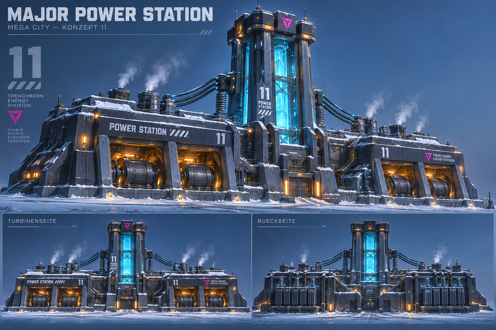

# MC-11 — Major Power Station

**Stadtteil:** Reactor Works  
**EnergyType:** `Electric`  
**Status:** Modell und Dressing erstellt; Studio-Abnahme offen.

## Freigegebenes Konzept

Zwei schwere Turbinenhallen mit zentralem cyan leuchtendem Energieturm, massiven Stützpfeilern und sichtbaren Stromverbindungen; rückseitige Transformatoren.

## Besondere Anforderungen

Turm, Hallen und Transformatoren gemeinsam.

## Zielbild

## Gemeinsame Vorgaben

- Frozen Cyberpunk Megacity: dunkles Petrol/Violett, blaues Glas, Cyan/Magenta, warme Fenster, Schnee und sichtbare Technik. Radiation wird grün gekennzeichnet.
- Klare Silhouette auch ohne Reklame; grosse Roblox-taugliche Formen. Zielbilder sind künstlerische Referenzen, keine masshaltigen Baupläne. Ansichtsabweichungen vor P4 auflösen.
- Jedes Grundmodell kollabiert als EINE Zerstörungseinheit. Separate Stadtumgebung bleibt separat.
- Nur Roblox Studio; kein Blender. Spätere Integration: Tag `KaijuHouse`, `MaxHealth` (Number), `EnergyType` (String).
- Dimensionen, Fussabdruck, Kopien und HP werden im Stadtplan/Technical Breakdown festgelegt; keine erfundenen Zahlen aus den Bildern übernehmen.

## Umsetzung und Abnahme (noch offen)

- [x] P1: Konzeptbrief im Chat bestätigt.
- [x] P2 / Gate A: Zielbild im Chat bestätigt (2026-09-30 bis 2026-10-02).
- [ ] Stadtplan-Abhängigkeit: Fussabdruck, Höhe und Platzierung freigeben.
- [x] P3: Technical Breakdown, Geometrie/Materialien, HP, Effekte und Part-Budget definieren.
- [ ] P4 / Gate B: Golden Master erstellen und gegen freigegebenes Bild aus drei Ansichten prüfen.
- [x] P5: Dressing, Neon, Schnee und freigegebene Effekte ergänzen.
- [ ] P6 / Gate C: Energie, Schaden, gemeinsame Zerstörung und Reset in Studio prüfen.
- [ ] P7: Final Installer und separat importierbares Asset bereitstellen.

Status 2026-10-03: MC-11 als direkt synchronisiertes rbxmx erstellt. Technischer Breakdown mit vorläufigen Massen und HP: [Review](../reviews/11-major-power-station.md). P4/Gate B wartet auf Studio-Sichtprüfung; Gate C auf Gameplay-Test. Direkte Vorschau: `mega-city-power.project.json`.

## GitHub-Task

[Issue #25](https://github.com/amanciobouza/trenchborn-asset-workshop/issues/25)

Abhängigkeit: [Stadtplan #14](https://github.com/amanciobouza/trenchborn-asset-workshop/issues/14).

