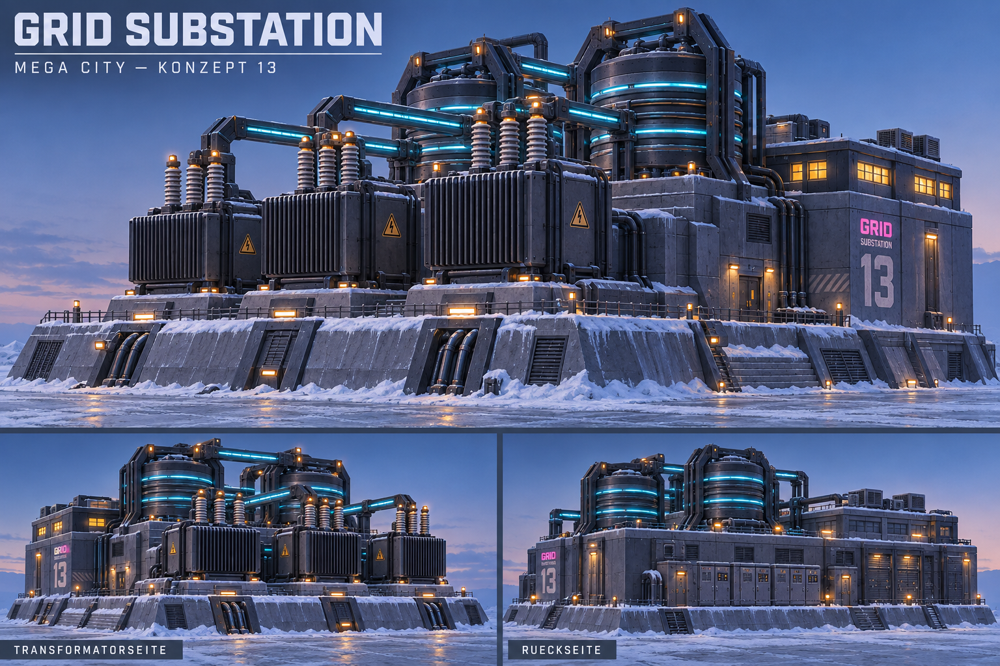

# MC-13 — Grid Substation

**Stadtteil:** Reactor Works  
**EnergyType:** `Electric`  
**Status:** Modell und Dressing erstellt; Studio-Abnahme offen.

## Freigegebenes Konzept

Drei gestaffelte Transformatoren, zwei massive Spulen, cyan leuchtende Stromschienen, grosse Isolatoren und niedriges Kontrollgebäude auf schwerem Sockel.

## Besondere Anforderungen

Gesamte Anlage inklusive Kontrollgebäude und Sockel gemeinsam.

## Zielbild

## Gemeinsame Vorgaben

- Frozen Cyberpunk Megacity: dunkles Petrol/Violett, blaues Glas, Cyan/Magenta, warme Fenster, Schnee und sichtbare Technik. Radiation wird grün gekennzeichnet.
- Klare Silhouette auch ohne Reklame; grosse Roblox-taugliche Formen. Zielbilder sind künstlerische Referenzen, keine masshaltigen Baupläne. Ansichtsabweichungen vor P4 auflösen.
- Jedes Grundmodell kollabiert als EINE Zerstörungseinheit. Separate Stadtumgebung bleibt separat.
- Nur Roblox Studio; kein Blender. Spätere Integration: Tag `KaijuHouse`, `MaxHealth` (Number), `EnergyType` (String).
- Dimensionen, Fussabdruck, Kopien und HP werden im Stadtplan/Technical Breakdown festgelegt; keine erfundenen Zahlen aus den Bildern übernehmen.

## Umsetzung und Abnahme (noch offen)

- [x] P1: Konzeptbrief im Chat bestätigt.
- [x] P2 / Gate A: Zielbild im Chat bestätigt (2026-09-30 bis 2026-10-02).
- [ ] Stadtplan-Abhängigkeit: Fussabdruck, Höhe und Platzierung freigeben.
- [x] P3: Technical Breakdown, Geometrie/Materialien, HP, Effekte und Part-Budget definieren.
- [ ] P4 / Gate B: Golden Master erstellen und gegen freigegebenes Bild aus drei Ansichten prüfen.
- [x] P5: Dressing, Neon, Schnee und freigegebene Effekte ergänzen.
- [ ] P6 / Gate C: Energie, Schaden, gemeinsame Zerstörung und Reset in Studio prüfen.
- [ ] P7: Final Installer und separat importierbares Asset bereitstellen.

Status 2026-10-03: MC-13 als direkt synchronisiertes rbxmx erstellt. [Technical Breakdown und Review](../reviews/13-grid-substation.md). Masse und HP bleiben vorläufig. Gate B und Gate C warten auf Studio-Abnahme. Direkte Vorschau: `mega-city-grid.project.json`.

## GitHub-Task

[Issue #27](https://github.com/amanciobouza/trenchborn-asset-workshop/issues/27)

Abhängigkeit: [Stadtplan #14](https://github.com/amanciobouza/trenchborn-asset-workshop/issues/14).

